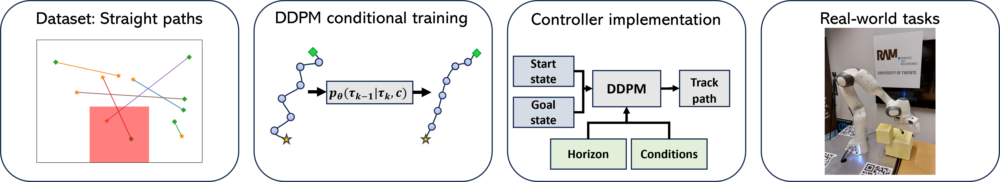

# Denoising Diffusion Planner: Learning Complex Paths from Low-Quality Demonstrations 
<div align="center">


</div>

Denoising Diffusion Probabilistic Models (DDPMs)
are powerful generative deep learning models that have been
very successful at image generation, and, very recently, in path
planning and control. In this paper, we investigate how to
leverage the generalization and conditional-sampling capabilities
of DDPMs to generate complex paths for a robotic end effector.
We show that training a DDPM with synthetical and low-quality
demonstrations is sufficient for generating nontrivial paths reach-
ing arbitrary targets and avoiding obstacles. Additionally, we
investigate different strategies for conditional sampling combin-
ing classifier-free and classifier-guided approaches. Eventually,
we deploy the DDPM in a receding-horizon control scheme
to enhance its planning capabilities. The Denoising Diffusion
Planner is experimentally validated through various experiments
on a Franka Emika Panda robot. 

This repo provides the code used for training the DDPMs.

# Installation
```
conda env create -f environment.yml
conda activate ddp
export PYTHONPATH=/path/to/ddp/
```

# Training
Training can be done by running the following commands: 

```bash
cd analysis
python train.py
```
Optionally, you can define more settings a YML file. Export it like so:
```
export CONFIG=/path/to/config
```

# Acknowledgements

This repo is an adaptation of the [Decision Diffuser repo](https://github.com/anuragajay/decision-diffuser/tree/main/code).